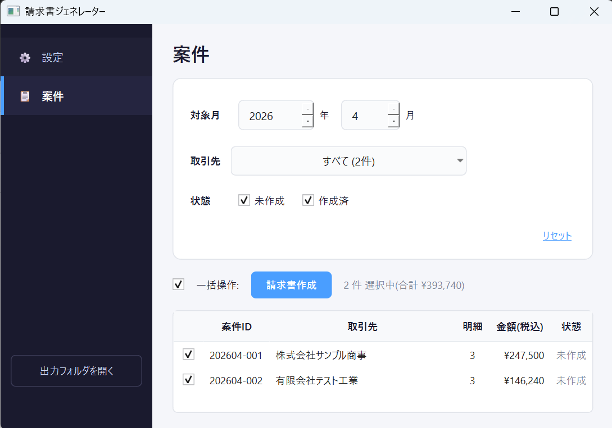
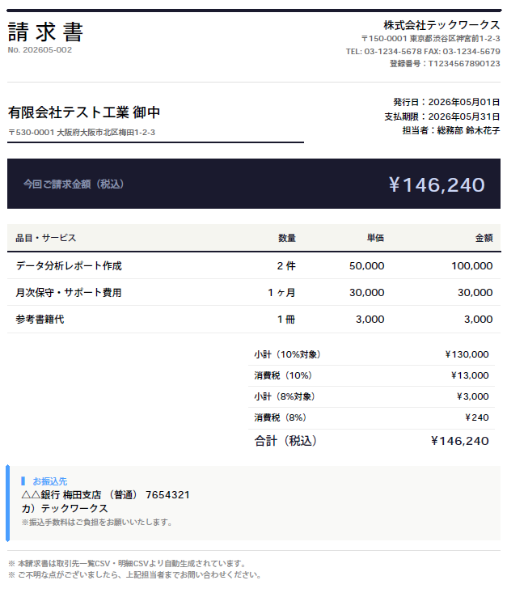

# 月次請求書 一括PDF生成ツール

取引先一覧と当月の作業明細（それぞれCSV）を読み込み、取引先ごとに請求書PDFを1枚ずつまとめて作成するツール。
**GUIアプリ付き** で非エンジニアの方もダブルクリックですぐ使えます。

## 特徴

- **インストール不要・Windows用exe配布** — Pythonが入っていないPCでもダブルクリックで起動
- **GUIアプリ付き** — 案件一覧から選んでボタンひとつで一括PDF化
- **税率混在に対応** — 10%と軽減税率8%が混ざっていても、税率ごとに小計・消費税を自動集計（区分記載請求書方式）
- **インボイス制度対応** — 登録番号を請求書に印字

---

## 使い方

### 用意するもの

exeと同じ階層に以下のファイルを配置します（サンプル一式が同梱されています）:

```
請求書ジェネレーター/
├── 請求書ジェネレーター.exe   ← ダウンロードしたexe
├── config.yaml                ← 自社情報（請求元）
└── data/
    ├── clients.csv            ← 取引先一覧
    └── items/
        ├── 2026-04.csv        ← 月別の明細（{YYYY-MM}.csv）
        └── 2026-05.csv
```

### 初回起動後に自動生成されるもの

```
請求書ジェネレーター/
├── settings.json              ← 直近の選択（対象月など）
└── output/
    └── 2026-05/
        ├── 株式会社サンプル商事_2026-05.pdf
        └── 有限会社テスト工業_2026-05.pdf
```

### 手順

1. 上記ファイルを配置
2. `請求書ジェネレーター.exe` をダブルクリック
3. 「案件」画面で対象月（前月が初期値）・取引先・状態で絞り込み



4. 一括操作のチェックボックスで案件を選択し「請求書作成」をクリック → 「出力フォルダを開く」で生成PDFを確認



> 開発者向けの技術資料は [docs/CORE.md](docs/CORE.md)（処理）と [docs/GUI.md](docs/GUI.md)（画面設計）を参照してください。

---

## 入力CSVの書き方

### 取引先一覧 (`data/clients.csv`)

| 列 | 内容 |
|---|---|
| `client_id` | 取引先ID（明細との結合キー） |
| `client_name` | 取引先名 |
| `postal_code` / `address` | 取引先住所 |
| `contact_name` | 自社の担当者（請求書に印字） |
| `bank_name` / `bank_branch` / `account_type` / `account_number` / `account_holder` | 振込先情報 |

### 当月明細 (`data/items/{YYYY-MM}.csv`)

対象月ごとに 1 ファイルを `data/items/` に配置します（例: `2026-05.csv`, `2026-06.csv`）。
GUIで対象月を切り替えると、自動で該当ファイルを読み込みます。

| 列 | 内容 |
|---|---|
| `client_id` | 取引先ID（取引先一覧との紐づけキー） |
| `item_name` | 品目・サービス名 |
| `quantity` / `unit` | 数量と単位（例: `3` `h`） |
| `unit_price` | 単価（円） |
| `tax_rate` | 税率（品目ごとに指定可。`0.10` / `0.08` 等） |

## 自社情報 (`config.yaml`)

```yaml
issuer:
  company_name: 株式会社テックワークス
  postal_code: 150-0001
  address: 東京都渋谷区神宮前1-2-3
  tel: 03-1234-5678
  fax: 03-1234-5679
  registration_number: T1234567890123
  notes:
    - 本請求書は取引先一覧CSV・明細CSVより自動生成されています。
    - ご不明な点がございましたら、上記担当者までお問い合わせください。
```

---

## 開発者向け情報

<details>
<summary>技術スタック / ディレクトリ構成 / テスト / 設計詳細</summary>

### 技術スタック

- **Python 3.12**
- **PySide6 (Qt 6)** (モダンGUI / Fusion + カスタムQSS)
- **ReportLab** (PDF描画・日本語CIDフォント `HeiseiKakuGo-W5` を同梱使用)
- **pandas** (CSV読込・集計) / **PyYAML** (設定ファイル)
- **PyInstaller** (単一exe配布)
- **pytest** (税計算の単体テスト)

### ディレクトリ構成

```
03_invoice_pdf_generator/
├── README.md
├── pyproject.toml             # 依存・パッケージ設定
├── app/
│   ├── invoice_generator/     # アプリ本体パッケージ
│   │   ├── core.py            # CSV→PDF生成のコアロジック (GUI/CLI共有)
│   │   ├── gui.py             # PySide6 GUI
│   │   ├── main.py            # CLI ラッパー
│   │   ├── loader.py          # CSV/YAML 読み込み・バリデーション
│   │   ├── calculator.py      # 税率別 小計/税額/合計 集計
│   │   └── pdf_renderer.py    # ReportLab で1枚PDF描画
│   └── scripts/
│       ├── run_app.py         # GUI/CLI 共通エントリ（exeはこれから生成）
│       └── build_exe.py       # PyInstaller ビルドスクリプト
├── config.yaml                # 自社情報
├── data/
│   ├── clients.csv            # 取引先一覧CSV
│   └── items/                 # 月別の明細CSV（{YYYY-MM}.csv）
│       ├── 2026-04.csv
│       └── 2026-05.csv
├── docs/                      # PLAN / デザインサンプル
├── tests/                     # pytest テスト
├── output/                    # 生成PDF出力先 (gitignore)
└── dist/                      # exe 出力先 (gitignore)
```

### テスト

税率混在・端数切り捨て・空明細などのケースを [tests/test_calculator.py](tests/test_calculator.py) で検証しています。

### 設計詳細

- 処理の設計: [docs/CORE.md](docs/CORE.md)
- GUI の設計: [docs/GUI.md](docs/GUI.md)

</details>

